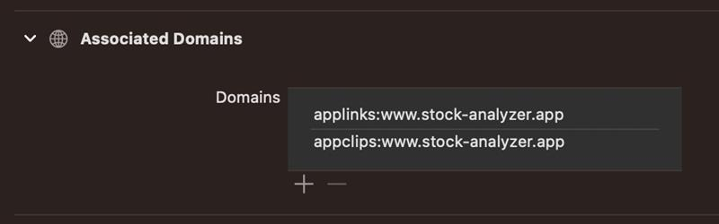

# ApzUniversalLinking

A Flutter plugin to handle **Universal Links** and **App Links** for both Android and iOS. It provides support for deep linking into your app and capturing initial and background link launches.

---

## 🔗 Features

- 🔗 Supports App Links & Universal Links
- 📡 `linkStream` for listening in foreground
- 🚀 `getInitialLink()` for cold-started deep links
- 🧭 Compatible with GoRouter, Navigator, and Bloc
- 📱 Android verified links via `assetlinks.json`
- 🌐 Fallback behavior using `404.html`.

---

## 📦 Installation

Add the dependency to your `pubspec.yaml`:

```yaml
dependencies:
  apz_universal_linking:
    git:
     url: http://prodgit.i-exceed.com:8009/appzillon-neu/core.git
      ref: develop
      path: apz_core/plugins/universal_linking/v1.0.0
```

### 🛠️ Platform Setup

#### ✅ Android
1. Add intent filter in your `AndroidManifest.xml`:

```xml
<activity
  android:name=".MainActivity"
  android:launchMode="singleTask"
  android:exported="true">
  <intent-filter android:autoVerify="true">
    <action android:name="android.intent.action.VIEW" />
    <category android:name="android.intent.category.DEFAULT" />
    <category android:name="android.intent.category.BROWSABLE" />

    <!-- Customize your pathPrefix and scheme -->
    <data
      android:scheme="https"
      android:host="example.com"
      android:pathPrefix="/product" />
    <!-- if need one more -->
    <data
      android:scheme="http"
      android:host="example.com"
      android:pathPrefix="/item" />
  </intent-filter>
</activity>

```
#### ✅ iOS
2. Add Associated Domains

### Enable Associated Domains Capability
In Xcode, select your project from the left panel, go to the `Signing & Capabilities` tab, and click the `+` Capability button. Choose **Associated Domains** from the list.

### Add Domain to Associated Domains
Under the newly added **Associated Domains** section, add your domain using the format `applinks:yourdomain.com`. For example, applinks:example.com. Be sure to include `applinks:` as the prefix.

Here is a screenshot:



3. Ensure your `MainActivity.kt` extends `FlutterFragmentActivity`:

```kotlin
class MainActivity : FlutterFragmentActivity() { }
```


```swift
// Universal Links
override func application(_ application: UIApplication, continue userActivity: NSUserActivity, restorationHandler: @escaping ([UIUserActivityRestoring]?) -> Void) -> Bool {
  if let url = userActivity.webpageURL {
    NotificationCenter.default.post(name: NSNotification.Name("ApzUniversalLinkReceived"), object: url)
    return true
  }
  return false
}
```

### Host
## For Android

1. ✅ Setup App Links with `assetlinks.json`:
2. Create a .well-known/assetlinks.json on your domain:
3. Path: https://yourdomain.com/.well-known/assetlinks.json

GitHub Pages Hosting Directory Structure:

```pgsql
your-repo/
├── .well-known/
│   └── assetlinks.json     <--  Required for Android App Link verification
├── 404.html                <--  Fallback page for unmatched deep links

```

```json
[{
  "relation": ["delegate_permission/common.handle_all_urls"],
  "target": {
    "namespace": "android_app",
    "package_name": "<your_package_name>",
    "sha256_cert_fingerprints": ["AA:BB:CC::DD...."]
  }
}]
```

## For iOS

1. ✅ Setup Links with `apple-app-site-association`:
2. Create a .well-known/apple-app-site-association on your domain(no extensions):
3. Path: https://yourdomain.com/.well-known/apple-app-site-association

GitHub Pages Hosting Directory Structure:

```pgsql
your-repo/
├── .well-known/
│   └── apple-app-site-association <--  Required for iOS App Link verification
│   └── assetlinks.json(already created for android)  

```

```json

{
  "applinks": {
    "apps": [],
    "details": [
      {
        "appID": "TEAMID.com.example.ii",
        "paths": [ "/product/*", "/item/*" ]
      }
    ]
  }
}

```

4. Fallback 404.html
Create a fallback so users who don’t have the app installed will navigate playstore or Appstore.

```html
<!DOCTYPE html>
<html>
  <head>
    <meta charset="UTF-8" />
    <title>Redirecting...</title>
    <script>
      const fullPath = window.location.pathname + window.location.search;
       const userAgent = navigator.userAgent || navigator.vendor || window.opera;

      // Customize redirection logic
      if (fullPath.startsWith("/path")) {
        if(/iPad|iPhone|iPod/.test(userAgent) && !window.MSStream){
            window.location.href ="Appstore link";
        }else {
          window.location.href = "playstore link";
        }
      } else if (fullPath.startsWith("/item")) {
         if(/iPad|iPhone|iPod/.test(userAgent) && !window.MSStream){
            window.location.href = "Appstore link";
        }else {
          window.location.href = "playstore link";
        }
      } else {
        // Default fallback (homepage or other fallback site)
        window.location.href = "/";
      }
    </script>
  </head>
  <body>
    <p>Redirecting...</p>
  </body>
</html>
```


### 🧩 Usage

1. Initialize and Listen

```dart
final ApzUniversalLinking universalLinking = ApzUniversalLinking();

universalLinking.linkStream.listen((LinkData url) {
  // Example log
   // Navigate to route
  try{
    print("Universal Link: ${url.path}");
  } on Exception catch(error){
    print(error);
  }
});

```

| Property  | Type   | Description                      |
| --------- | ------ | -------------------------------- |
| `scheme`  | String | e.g. `https`                     |
| `host`    | String | e.g. `example.com`               |
| `path`    | String | e.g. `/product`                  |
| `fullUrl` | String | Full link string                 |


## Jira Ticket Link
- [Universal_Linking](https://appzillon.atlassian.net/browse/AN-83)
